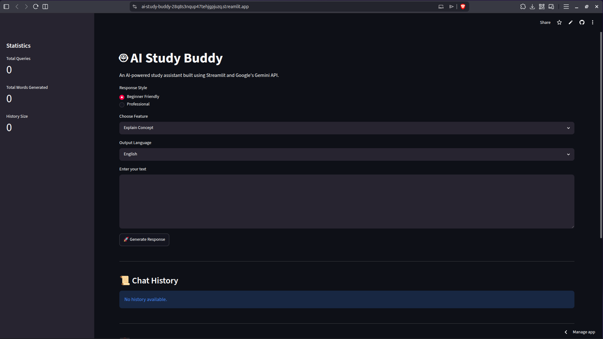
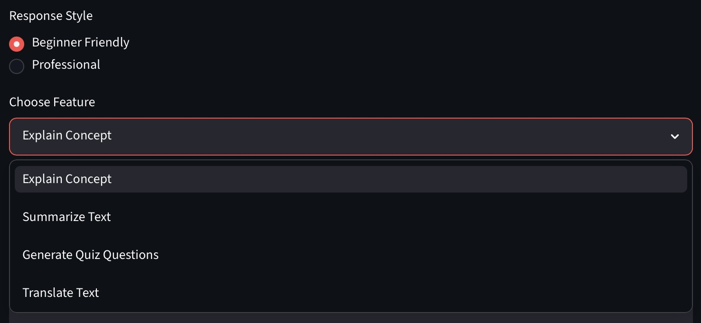
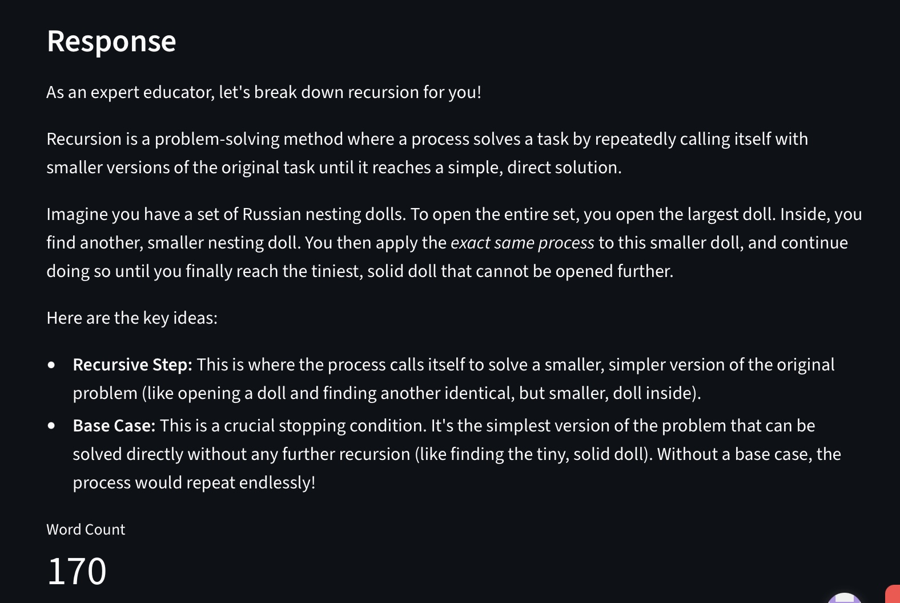
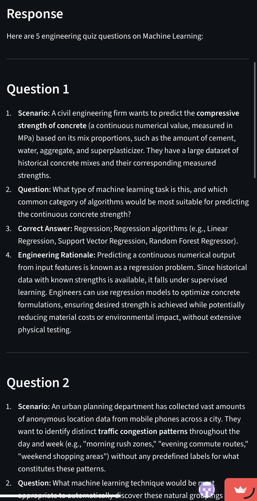
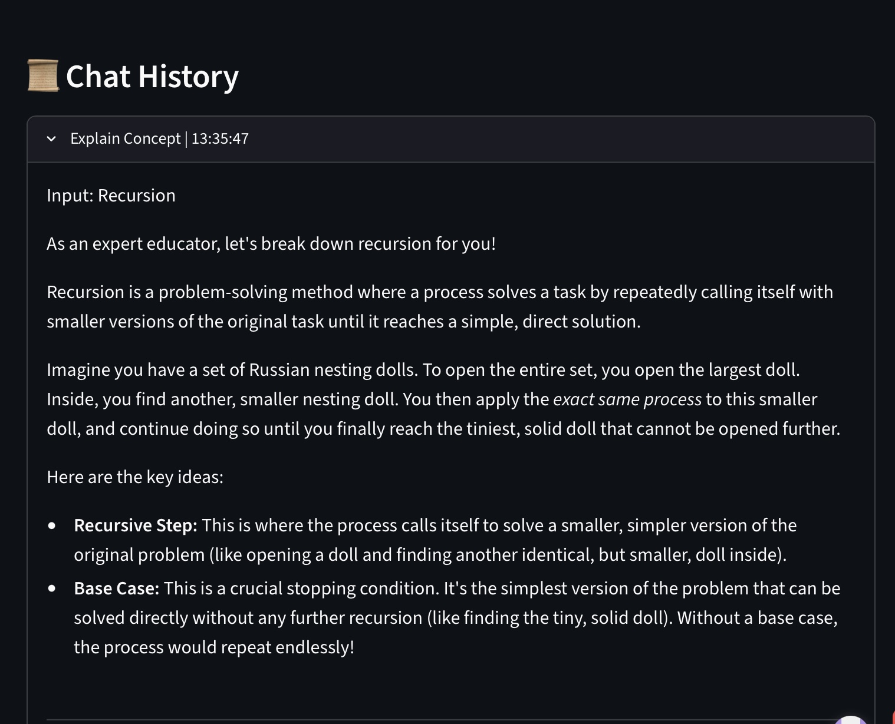
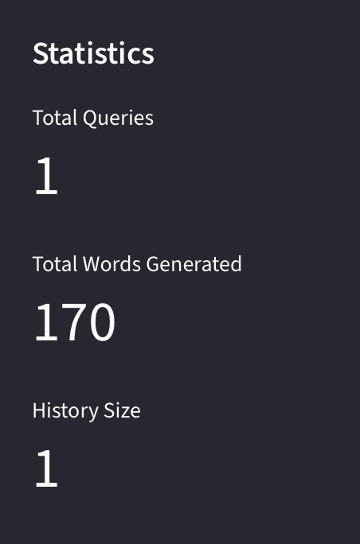
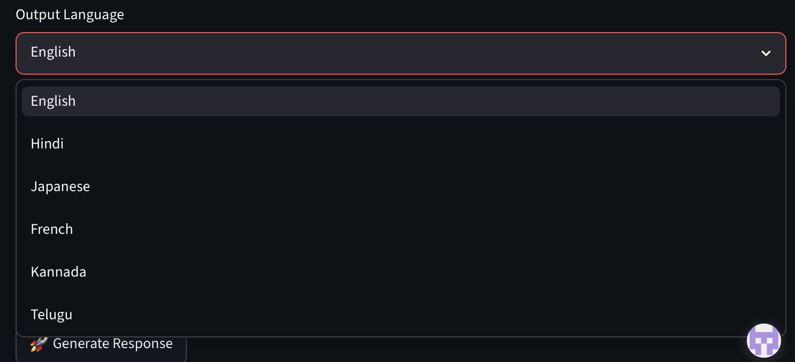

# 🤖 AI Study Buddy

AI Study Buddy is a web-based AI assistant built using Python, Streamlit, and Google's Gemini API.

The application helps students learn faster by explaining concepts, summarizing text, generating quiz questions, and translating content into multiple languages.

## Features

### Core Features

* Explain Concepts
* Summarize Text
* Generate Quiz Questions

### Additional Features

* Translate Text
* Multiple Language Support
* Beginner & Professional Response Modes
* Chat History
* Download Responses
* Session Statistics

## Technologies Used

* Python
* Streamlit
* Google Gemini API
* Python Dotenv

## Project Structure

ai-study-buddy/

├── streamlit_app.py

├── app.py

├── requirements.txt

├── README.md

└── screenshots/

## Screenshots

### Home Page



### Features



### Explain Concept



### Quiz Generator



### Chat History



### Statistics



### Multi Language Support



## What I Learned

* Working with APIs
* Prompt Engineering
* Streamlit Web Development
* Environment Variables
* Git and GitHub
* Cloud Deployment


## Installation

```bash
git clone https://github.com/ashishh0555/ai-study-buddy.git

cd ai-study-buddy

python -m venv .venv

source .venv/bin/activate

pip install -r requirements.txt

streamlit run streamlit_app.py
```

## Live Demo

[https://ai-study-buddy-28q8s3nqup47tehjgpjuzq.streamlit.app/]

## Author

Ashish Kumar

MIT Manipal
